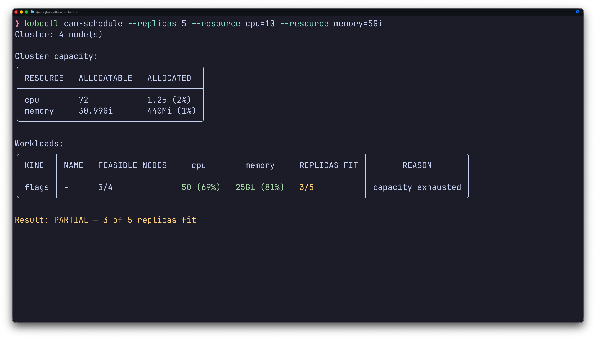
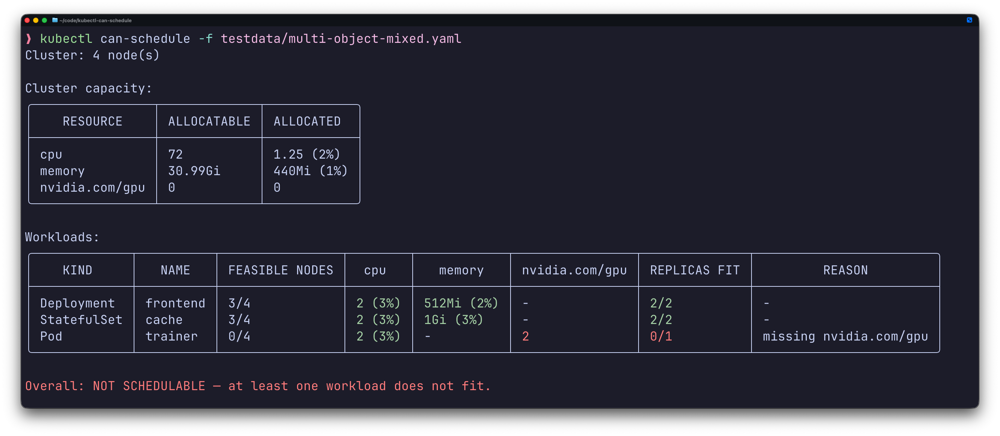

# kubectl can-schedule

A `kubectl` plugin that answers a simple question: **can this workload land on
the cluster right now, and if not, why?**

It runs the **default scheduler's filter plugins** (the same PreFilter + Filter
logic the real kube-scheduler uses) against a live snapshot of the cluster. It is
not a scorer or an optimizer — it does not try to find the *best* node, it only
reports whether the requested workloads fit.

Check ad-hoc resource requests with flags:



Or check one or more manifests (Pods, Deployments, StatefulSets):



The **cluster capacity** table (shown once) reports, per requested resource,
total `ALLOCATABLE` and how much is already `ALLOCATED` with its percentage. The
**workloads** table has one row per input object: its `KIND` and `NAME`, how many
nodes a single replica passes all filters on (`FEASIBLE NODES`), the amount each
resource `REQUESTED` (as a percentage of allocatable), the fit ratio
(`REPLICAS FIT` = placed/requested), and a concise `REASON` when it does not
fully fit. Requested cells and the fit ratio are color-coded (pastel
green/amber/red) on a terminal — green fits, amber is partial or insufficient,
red does not fit or is absent. A single `Overall` verdict closes the report.

## How it works

- Builds an in-process scheduler `Framework` configured with the **default
  scheduler profile**, so the full default filter set runs: `NodeResourcesFit`,
  `NodeAffinity`, `NodePorts`, `NodeUnschedulable`, `TaintToleration`,
  `PodTopologySpread`, `InterPodAffinity`, `VolumeRestrictions`, `VolumeBinding`,
  `VolumeZone`, `NodeVolumeLimits`, `DynamicResources`, `NodeDeclaredFeatures`.
- Snapshots the live cluster (nodes + scheduled pods) and supplies the volume
  objects the volume plugins need (PV, PVC, StorageClass, CSINode) from informers,
  so topology-spread, inter-pod-affinity, and volume filters evaluate accurately.
- Places replicas **greedily, first-fit** in node-name order, **decrementing
  capacity** as each replica lands. Multiple input objects are one **cumulative
  batch** competing for the same capacity, in input order.
- Candidate nodes are all nodes in the cluster; not-ready / cordoned /
  control-plane nodes are excluded naturally by the default filters (taints,
  `spec.unschedulable`), not by special-casing.

Resource fitting uses **requests**, and the scheduler's native resource
accounting (init containers, native sidecars, pod overhead) is honored.

## Install

The kubectl plugin mechanism turns a `kubectl-can_schedule` binary on your `PATH`
into the `kubectl can-schedule` subcommand (the `_` becomes `-`).

```
make install                 # builds to $(go env GOPATH)/bin/kubectl-can_schedule
# or:
go build -o ~/bin/kubectl-can_schedule ./cmd/kubectl-can_schedule

kubectl can-schedule --help
kubectl plugin list | grep can-schedule
```

## Usage

Input is **either** manifest files **or** resource flags (mutually exclusive).

### Manifests (Pod, Deployment, StatefulSet)

Each file may contain multiple `---`-separated documents, and you may pass `-f`
multiple times. Each object uses its **own** replica count
(`.spec.replicas`, default 1; a bare Pod = 1).

```
kubectl can-schedule -f deploy.yaml -f statefulset.yaml
cat pod.yaml | kubectl can-schedule -f -
```

### Synthetic workload from resource flags

`--resource` is repeatable and accepts any `resource.Quantity`-typed resource.
Values are **per replica**; `--replicas` multiplies the count.

```
kubectl can-schedule \
  --resource cpu=2 \
  --resource memory=4Gi \
  --resource ephemeral-storage=10Gi \
  --resource nvidia.com/gpu=1 \
  --replicas 16
```

### Flags

| Flag | Description |
|------|-------------|
| `-f, --filename` | Manifest file(s); repeatable; `-` for stdin. |
| `--resource <name>=<qty>` | Per-replica request; repeatable. Mutually exclusive with `-f`. |
| `--replicas` | Replica count for flag-based input (invalid with `-f`). |
| `--consider-preemption` | Also consider evicting lower-priority pods (see below). |
| `--kubeconfig` | Path to the kubeconfig file (defaults to the standard loading rules). |
| `--context` | Kubeconfig context to use (defaults to the current context). |
| `-n, --namespace` | Namespace for manifests/pods that don't specify one. |

The output reports total cluster allocatable capacity, the total requested by the
workload, whether the requested workloads fit, and — when they don't — the filter
plugins that rejected them. The exit code is the machine-readable signal (see
below).

### Preemption

By default preemption is ignored: a node counts as a fit only if the pod fits
given current occupancy. With `--consider-preemption`, when a replica fails on
all nodes the tool simulates evicting **lower-priority** pods (lowest first) to
make room. It is automatically a **no-op for pods at or below the default
priority** (nothing lower to evict). `priorityClassName` is resolved from the
cluster's PriorityClasses.

The preemption pass is **non-destructive** — it never deletes or mutates real
pods; it only evaluates filters against a temporary in-memory snapshot.

### Exit codes

| Code | Meaning |
|------|---------|
| `0` | Every replica of every workload fits. |
| `1` | At least one replica does not fit. |
| `2` | Usage / runtime error. |

## Known limitations / approximations

- **Scoring is out of scope.** Placement is first-fit on filters only; it does
  not mimic the scheduler's node *preference*, only feasibility.
- **Preemption** considers pod priority only — PodDisruptionBudgets are not
  consulted — and evaluates filters, consistent with the rest of the tool.
- **StatefulSet `volumeClaimTemplates`** are approximated by synthesizing the
  per-ordinal PVCs so volume filters can evaluate them. A claim that omits a
  `storageClassName` inherits the cluster's default StorageClass (mirroring PVC
  admission); this models `WaitForFirstConsumer` provisioning well but is not a
  guarantee that dynamic provisioning will succeed at bind time.
- Pods are evaluated as if they use the **default scheduler**, regardless of
  `spec.schedulerName`.
- **Resource names are validated** like the Kubernetes API validates container
  resources: an unqualified name must be standard (`cpu`, `memory`,
  `ephemeral-storage`, `hugepages-*`), otherwise it must be fully qualified (e.g.
  `nvidia.com/gpu`). An unqualified custom name such as `gpu` is rejected, because
  the scheduler would silently ignore it and wrongly report a fit.
- The scheduler libraries are pinned to a specific Kubernetes version
  (see `go.mod`); default plugins/feature-gates match that version.

## Development

```
make build   # build ./bin/kubectl-can_schedule
make test    # go test ./...
make vet
```
